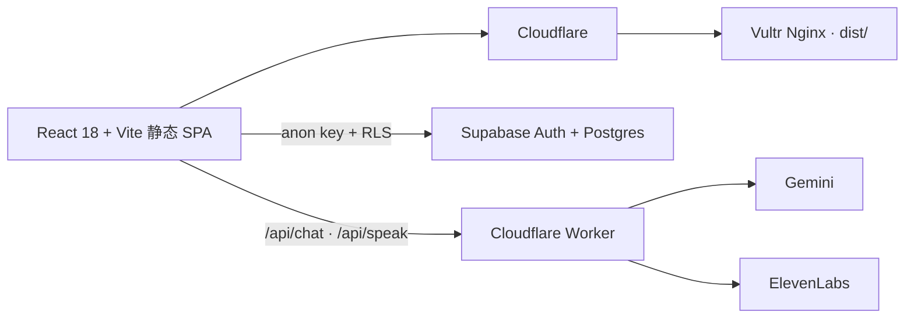

# Raccord

> 世界持续存在，章节在其中发生。

[](https://rucmathclass.com/)
[](LICENSE)

Raccord 是一件持续生长的作者数字作品。它诞生于中国人民大学中法学院 2025 级数学班，但不代表班级的集体审美、立场或愿望。

它把数学、哲学、语言、飞行与数字媒介中的问题变成可以进入的世界。访问者不必完成任务；一次真实的选择、感知变化或离开后的余韵，就可以构成作品。

## 作品结构

- **世界**持续存在，拥有自己的时间、材料、记忆与交互法则；
- **章节**是世界生命中发生、并可能改变世界的一次相遇；
- **世界生命**是不必被包装成章节的环境、材质与日常痕迹；
- **实验档案**保存曾经承担核心探索、后来退出当前作品的实验；
- **工具层**保留有实际用途、但不构成作品中心的能力。

完整判断标准见 [`docs/design/product-constitution.md`](docs/design/product-constitution.md)，领域语言见 [`CONTEXT.md`](CONTEXT.md)。

## 当前世界

| 世界 | 当前引力 | 本期材料 |
|---|---|---|
| **PLAN ℝ** | 秩序、数学、构造与理性 | 骨白工程面、钴蓝、坐标与连续曲线 |
| **Le Carnet** | 语言、记忆、哲学与时间 | 象牙纸、墨迹、纤维与缓慢显影 |
| **Limite** | 飞行、边界、风险与远方 | 暖近黑、低照度仪器、朱红活性信号 |

这些是世界当前的引力，不是知识分类或永久功能分工。首访进入 `/enter` 选择世界；选择写入 `localStorage.carnet_world`，并映射到 `<html data-world>`。

## 当前章节

**Chapitre I · Le ciel de Poincaré**

同一份 `poincare_sky_v1` 命运对象穿过三个世界：

- PLAN 允许改变初始条件；
- Le Carnet 让此前的轨迹成为记忆；
- Limite 让时间暴露分离与不可预测性。

第一章当前直接装配在 `/`。它的三幕结构属于这一章，不是以后章节的固定模板。

## 工具与来源

现有能力继续保留，但不进入世界中心：

- `/vocabulary`：法语 SRS；
- `/assistant`：在具体学习失败后调用的上下文工具；
- `/resources`：书目与外部资源；
- `/recueil`：保留的定理辑录；
- `/atelier`：资源增补入口；
- `/testimonials`：只读来源附录。

`Raccord 01` 已退出当前首页，代码作为实验档案材料保留；可进入的档案入口尚未完成。

## 架构



前端永远只使用 Supabase anon key。service-role、Gemini key 与 ElevenLabs key 不进入浏览器产物。

## 本地开发

要求 Node.js 20+。

```bash
npm install
npm run dev
```

质量门：

```bash
npm run lint
npm test
npm run build
npm audit --omit=dev --audit-level=high
```

`predev` 与 `prebuild` 会自动运行：

- `scripts/render-theorems.mjs`
- `scripts/generate-health.mjs`

## 保留的数据与数据库

### 历史内容管线

- 源：`src/data/siteContent.js`
- 双语证明源：`src/data/theoremExplanations.js`
- 构建产物：`dailyTheoremNotes.generated.js`、`theoremExplanations.generated.js`

这些文件仍参与既有工具和构建流程，不代表当前首页仍是 “Page du jour”。

### 词库

真相源是 `scripts/vocab-source.json`。不要直接手改生成后的 3650 行词库。

```bash
npm run vocab:import scripts/vocab-source.json
npm run vocab:import scripts/vocab-source.json -- --out src/data/frenchVocabulary.js
```

已有词条 `id` 对应用户的 `review_states.word_id`，不可随意更改。

### Supabase setup

按需要执行：

```text
setup_vocabulary.sql
setup_ai_history.sql
setup_testimonials.sql
```

全项目的权威 RLS 状态是 `harden_rls.sql`。新环境完成基础建表后运行它；旧的 `enable_rls.sql` 不是最终策略来源。

寄语表未创建时，`/testimonials` 会保留历史档案并优雅降级为只读。

## 安全边界

- `comments.album_id = 0` 是 ops queue，审核信封以 `__mathclass_ops__::` 开头；普通用户不得伪造 moderation 回执。
- anon 对 `comments.user_email` 没有读取权；前端查询必须使用显式列名。
- 角色提升只经过 `public.is_super_admin()`。
- `testimonials` 不保存 email；公开 SELECT，认证用户只能以自己的 `auth.uid()` 写入或修改。
- AI 与语音密钥只存在于 Cloudflare Worker secrets。

## Web3 退役说明

2026-07-03 起，钱包连接、ed25519 身份 UI、SPL Memo 写入、链上 feed 与 Solana 浏览器依赖全部退役。唯一的人类 `class_anchor` 寄语已迁入 `src/data/testimonialArchive.js`，身份型 Memo 只保留数量与来源记录。

`programs/class-anchor/`、IDL 和 `docs/anchor-program.md` 留作历史材料，但不再 build 或 deploy。旧的 `/witness`、`/web3-profile` 与 `/hackathon` 链接会重定向到新的寄语簿。

## 部署

线上唯一部署入口：

```bash
MATHCLASS_DEPLOY_HOST=149.28.69.75 \
MATHCLASS_DEPLOY_USER=root \
MATHCLASS_DEPLOY_SSH_KEY=~/.ssh/mathclass_deploy \
./deploy.sh
```

脚本从本地归档仓固定 commit `a88bdc5` 临时注入真实班级照片，再构建和 rsync；退出时清理照片。不要运行兄弟仓 `MathClassWebsite/deploy.sh`。

部署后验证：

- `https://rucmathclass.com/health.json`
- `http://149.28.69.75/health.json`

两者的 buildTime 与内容应一致。

## License

[MIT](LICENSE)
