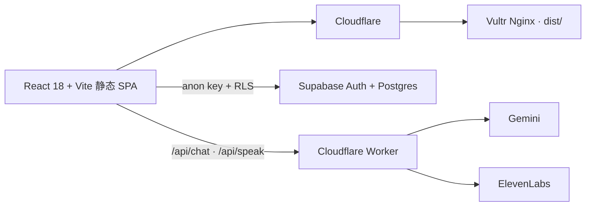

# Carnet de classe

> 同一天 · 同一条定理 · 同一句冥想 — 三种排法。

[](https://rucmathclass.com/)
[](LICENSE)

中国人民大学中法学院 2025 级数学班的双语班级档案。它不是追求活跃度的产品：一次九十秒的来访，带走一条定理、一句法语或一段班级记忆，就够了。

## 三个世界

| 世界 | 职责 | 视觉 |
|---|---|---|
| **Le Carnet** | 默认首都与档案馆：今日一页、寄语簿、完整导航 | 象牙纸、墨黑、氧化红；EB Garamond + Noto Serif SC |
| **PLAN ℝ** | 国门与门面：今日海报、Bibliographie | 骨白、墨黑、钴蓝；Archivo 900 + 坐标方格 |
| **Limite** | 仪器间：今日信号、SRS 背词、AI 助手 | 暖近黑、骨白、电光朱；动态二分读数与打字机 |

首访进入 `/enter` 选择世界。选择写入 `localStorage.carnet_world`，并映射到 `<html data-world>`；顶栏的 `⇄ changer` 可随时重新选择。

## 现在可以做什么

- **Page du jour**：按上海日期从 24 条定理与冥想语料轮换；三世界共享内容，各自排版。
- **双语证明**：每条定理包含中文与法文证明思路，构建期预渲染 KaTeX。
- **SRS 背词器**：约 3650 条法语词汇、A1–C2 分级、六种题型、艾宾浩斯复习阶梯、真人发音回退链。
- **班级 AI 助手**：Cloudflare Worker 代理 Gemini，支持中法双语、KaTeX、图片问题与 per-user 云端历史。
- **寄语簿**：历史记录公开可读；登录用户通过 Supabase + RLS 署名写入。
- **书目与协作**：资源目录、资源增补和管理员审核仍沿用原来的 Supabase 边界。

## 架构



前端永远只使用 Supabase anon key。service-role、Gemini key 与 ElevenLabs key 不进入浏览器产物。

## 本地开发

要求 Node.js 20+。

```bash
npm install
npm run dev
```

质量门：

```bash
npm run lint
npm test
npm run build
npm audit --omit=dev --audit-level=high
```

`predev` 与 `prebuild` 会自动运行：

- `scripts/render-theorems.mjs`
- `scripts/generate-health.mjs`

## 数据与数据库

### 每日定理

- 源：`src/data/siteContent.js`
- 双语证明源：`src/data/theoremExplanations.js`
- 构建产物：`dailyTheoremNotes.generated.js`、`theoremExplanations.generated.js`

### 词库

真相源是 `scripts/vocab-source.json`。不要直接手改生成后的 3650 行词库。

```bash
npm run vocab:import scripts/vocab-source.json
npm run vocab:import scripts/vocab-source.json -- --out src/data/frenchVocabulary.js
```

已有词条 `id` 对应用户的 `review_states.word_id`，不可随意更改。

### Supabase setup

按需要执行：

```text
setup_vocabulary.sql
setup_ai_history.sql
setup_testimonials.sql
```

全项目的权威 RLS 状态是 `harden_rls.sql`。新环境完成基础建表后运行它；旧的 `enable_rls.sql` 不是最终策略来源。

寄语表未创建时，`/testimonials` 会保留历史档案并优雅降级为只读。

## 安全边界

- `comments.album_id = 0` 是 ops queue，审核信封以 `__mathclass_ops__::` 开头；普通用户不得伪造 moderation 回执。
- anon 对 `comments.user_email` 没有读取权；前端查询必须使用显式列名。
- 角色提升只经过 `public.is_super_admin()`。
- `testimonials` 不保存 email；公开 SELECT，认证用户只能以自己的 `auth.uid()` 写入或修改。
- AI 与语音密钥只存在于 Cloudflare Worker secrets。

## Web3 退役说明

2026-07-03 起，钱包连接、ed25519 身份 UI、SPL Memo 写入、链上 feed 与 Solana 浏览器依赖全部退役。唯一的人类 `class_anchor` 寄语已迁入 `src/data/testimonialArchive.js`，身份型 Memo 只保留数量与来源记录。

`programs/class-anchor/`、IDL 和 `docs/anchor-program.md` 留作历史材料，但不再 build 或 deploy。旧的 `/witness`、`/web3-profile` 与 `/hackathon` 链接会重定向到新的寄语簿。

## 部署

线上唯一部署入口：

```bash
MATHCLASS_DEPLOY_HOST=149.28.69.75 \
MATHCLASS_DEPLOY_USER=root \
MATHCLASS_DEPLOY_SSH_KEY=~/.ssh/mathclass_deploy \
./deploy.sh
```

脚本从本地归档仓固定 commit `a88bdc5` 临时注入真实班级照片，再构建和 rsync；退出时清理照片。不要运行兄弟仓 `MathClassWebsite/deploy.sh`。

部署后验证：

- `https://rucmathclass.com/health.json`
- `http://149.28.69.75/health.json`

两者的 buildTime 与内容应一致。

## License

[MIT](LICENSE)
