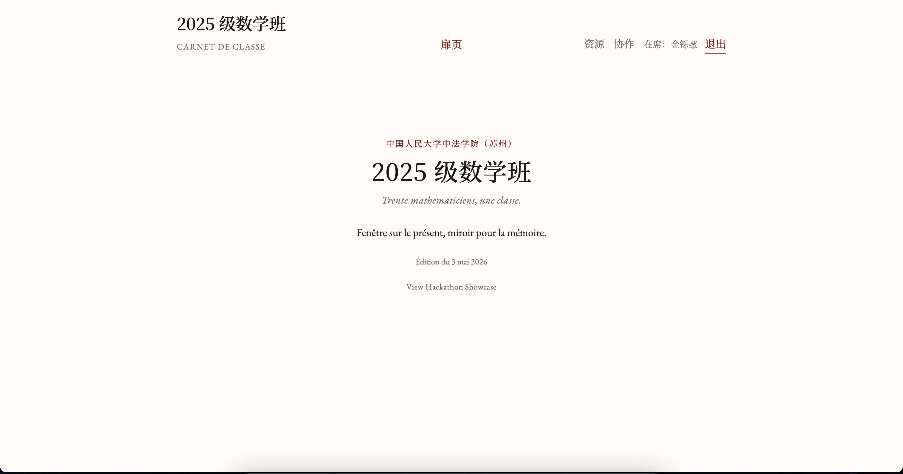
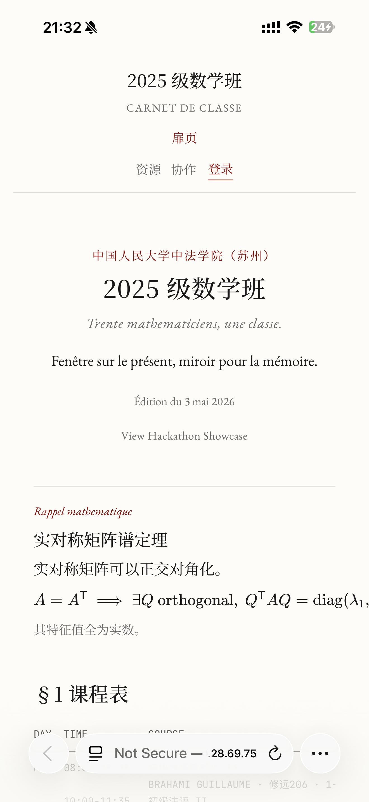
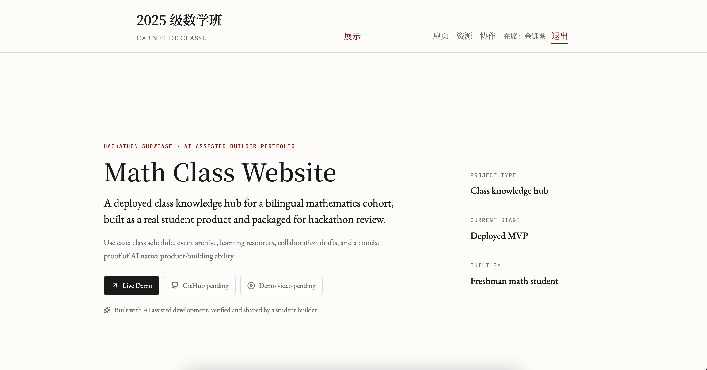
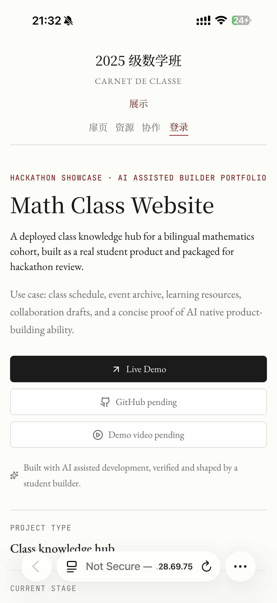
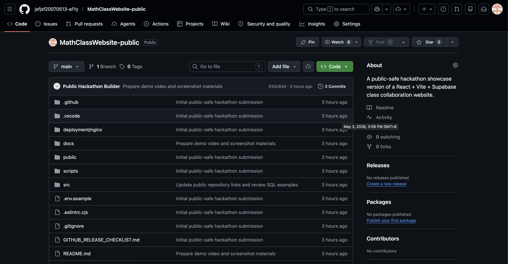
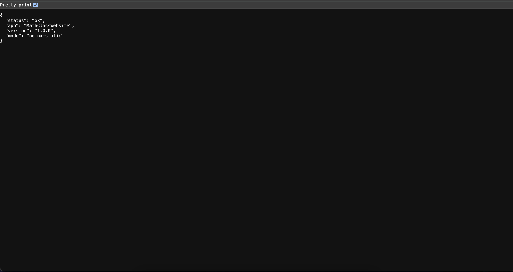

# Math Class Website

A deployed class knowledge hub and hackathon showcase built by a freshman mathematics student with AI assisted development.

## Live Demo

- Production site: [http://149.28.69.75/](http://149.28.69.75/)
- Health metadata: [http://149.28.69.75/health.json](http://149.28.69.75/health.json)

## Hackathon Showcase

- Showcase page: [http://149.28.69.75/hackathon](http://149.28.69.75/hackathon)
- This page is designed for hackathon judges, teammate matching, and portfolio review.
- GitHub repository: [https://github.com/jsfjsf20070513-a11y/MathClassWebsite-public](https://github.com/jsfjsf20070513-a11y/MathClassWebsite-public)

## Web3 Student Profile MVP

- MVP page: `/web3-profile`
- This is the first Dev3pack preparation feature: an AI-assisted student collaboration website with Solana wallet-based identity and contribution records.
- Current status: real browser wallet connection MVP using an injected Solana wallet provider such as Phantom.
- It displays the public wallet address only. It does not request signatures, perform smart contract calls, send devnet transactions, or send mainnet transactions.
- Future phase: evaluate Solana Wallet Adapter or compatible wallet integration and connect wallet identity to verified contribution records.
- Safety notes: no private keys, no seed phrases, no service role key, and no mainnet transaction are handled in this stage.

## Demo Video

[https://youtu.be/kz9K5mWtC20](https://youtu.be/kz9K5mWtC20)

## Screenshots

### Homepage Desktop



### Homepage Mobile



### Hackathon Showcase Desktop



### Hackathon Showcase Mobile



### GitHub Repository



### Health Check



## Problem

Small student cohorts often keep important class information in scattered chat messages, temporary links, cloud folders, and personal notes. That makes schedules, event memories, and learning resources hard to revisit later.

For a bilingual mathematics class, the information is even more mixed: mathematics courses, French-language courses, class activities, reading paths, and shared resource lists all need a stable place.

## Solution

Math Class Website is a lightweight React/Vite single-page application that turns the class record into a readable public website. It keeps the original class-homepage purpose while adding a dedicated `/hackathon` showcase page so judges can understand the product, stack, builder role, and AI workflow quickly.

The current product flow:

1. Visitors open the homepage and see the class identity, schedule, theorem note, image plates, and reading paths.
2. Visitors browse albums and curated learning resources without login.
3. Authenticated collaborators can use Supabase-backed workflows for login, comments, submissions, review, and published content.
4. Hackathon judges open `/hackathon` for a concise product and builder overview.

## Key Features

- Class archive homepage: a stable entry point for class identity, course context, and daily mathematical notes.
- Gallery and album pages: structured records for class activities and photos.
- Resource catalog: curated learning resources with detail pages.
- Supabase collaboration flow: optional login, comments, submission workspace, and moderation routes.
- Hackathon showcase: a review-ready page explaining the project, tech stack, my role, AI workflow, and roadmap.
- Static deployment health check: generated `/health.json` plus an Nginx `/health` sample that returns JSON instead of SPA fallback HTML.

## Tech Stack

- Frontend: React 18, React Router 7, Vite 5
- UI: custom CSS, lucide-react icons, KaTeX, local fonts
- Backend: not used yet as a local server; the current production app is a static SPA
- Database: Supabase Postgres when configured
- Authentication: Supabase Auth
- Deployment: Vite build output, Nginx static hosting, rsync deployment script
- Package manager: npm with `package-lock.json`
- AI tools: Codex GPT 5.5, Claude Opus, Claude Sonnet, Gemini Google AI Pro

## Architecture

```text
Browser
  |
  | requests static pages/assets
  v
Nginx on VPS
  |
  | serves dist/ generated by Vite
  v
React SPA
  |
  | optional client-side SDK calls when env vars are configured
  v
Supabase Auth + Postgres + RLS policies
```

There is no custom Node/Express backend in the current production version. If a future backend is added, the included Nginx sample has a commented `/api/` reverse-proxy block.

## Getting Started

Install dependencies:

```bash
npm install
```

Start local development:

```bash
npm run dev
```

Build for production:

```bash
npm run build
```

Preview the production build locally:

```bash
npm run preview
```

Run lint checks:

```bash
npm run lint
```

Generate health metadata only:

```bash
npm run health:generate
```

## Environment Variables

Create `.env.local` from `.env.example` when Supabase features are needed:

```bash
cp .env.example .env.local
```

Available variables:

```bash
VITE_SUPABASE_URL=
VITE_SUPABASE_ANON_KEY=
```

Important security notes:

- Variables prefixed with `VITE_` are exposed to browser-side JavaScript. Do not put service role keys, private API keys, passwords, or other secrets in them.
- The frontend can only use a Supabase publishable key / anon key.
- The Supabase service role key must never be placed in frontend code, `.env.local`, `.env.example`, or any `VITE_` variable.
- The Supabase anon key can be used as a browser-side publishable key, but tables must be protected with Row Level Security.
- All Supabase `public` schema tables should be reviewed table by table for Row Level Security policies before public use.
- Recheck `anon` and `authenticated` role permissions before making the repository public or accepting real users.
- Do not commit `.env.local` to Git. This repository keeps `.env.local` ignored.

## Deployment

Current deployment model: build locally, then sync `dist/` to the server directory used by Nginx.

```bash
npm run build
export MATHCLASS_DEPLOY_HOST=<SERVER_HOST>
export MATHCLASS_DEPLOY_USER=<SERVER_USER>
export MATHCLASS_DEPLOY_SSH_KEY=~/.ssh/<DEPLOY_KEY>
./deploy.sh
```

Do not commit real server login details or SSH key paths. Keep deployment host, user, and key path in local shell environment variables.

Expected production directory on the server:

```bash
/var/www/<PROJECT_NAME>/dist
```

Suggested Nginx config is included at:

```text
deployment/nginx/mathclasswebsite.conf
```

Install or update Nginx config on the server:

```bash
sudo sed -i 's/<SERVER_NAME>/your-domain.example/g; s/<PROJECT_NAME>/MathClassWebsite/g' deployment/nginx/mathclasswebsite.conf
sudo cp deployment/nginx/mathclasswebsite.conf /etc/nginx/sites-available/mathclasswebsite
sudo ln -sfn /etc/nginx/sites-available/mathclasswebsite /etc/nginx/sites-enabled/mathclasswebsite
sudo nginx -t
sudo systemctl reload nginx
```

Check public access:

```bash
curl -I http://149.28.69.75/
curl http://149.28.69.75/health.json
curl -i http://149.28.69.75/health
```

For HTTPS later, point a domain to the VPS and run:

```bash
sudo apt update
sudo apt install certbot python3-certbot-nginx
sudo certbot --nginx -d your-domain.example
```

## Supabase Security Notes

The project uses Supabase only when the public Vite variables are configured. Because this is a browser-side integration:

- Never use a Supabase service role key in the frontend.
- Keep RLS enabled on all public-facing tables.
- Recheck `anon` and `authenticated` policies on every table in the `public` schema.
- Confirm read/write policies for comments, submissions, albums, resources, and moderation tables.
- Treat client-side role checks as UX helpers, not as the final security boundary.
- Prefer server-side functions or Supabase policies for any sensitive future workflow.
- Admin setup SQL is intentionally kept out of the public repository unless provided as an example. Replace placeholders such as `YOUR_ADMIN_EMAIL@example.com` before private deployment.

## Public-safe Content Notes

This public repository uses anonymized sample content. Real class photos, private uploads, precise room schedules, and admin setup files should stay in private storage or a private deployment repository unless every relevant permission is confirmed.

## AI assisted Development Process

AI was used as a development accelerator, not as a replacement for product judgment.

- Codex GPT 5.5: code generation, debugging, refactoring, deployment scripts, build checks, and documentation structure.
- Claude Opus: complex architecture review and difficult issue analysis.
- Claude Sonnet: frontend page drafting, copy refinement, and long-context organization.
- Gemini Google AI Pro: research, competitor scan, presentation material, and demo preparation.

My responsibility was to define the problem, choose the product direction, verify outputs, test the deployed result, and decide what should be accepted.

## My Role

I am a first-year Mathematics student at Renmin University of China, Sino-French Institute in Suzhou.

In this project, I was responsible for:

- Requirement breakdown
- Product logic design
- AI assisted coding
- Frontend prototype implementation
- Supabase-backed feature integration
- Debugging and deployment verification
- Hackathon showcase, README, and application material preparation

The goal is to present a credible student-builder profile: mathematics background, AI native workflow, fast prototype delivery, and willingness to collaborate on-site during hackathons.

## Roadmap

Before hackathon:

- Record demo video and add screenshots.
- Submit the project to hackathon platforms.
- Review Supabase RLS policies carefully.
- Apply the `/health` Nginx exact-match config on the server.

During hackathon:

- Use this site as a live portfolio for teammate matching.
- Extend the prototype around a clear user workflow.
- Document AI prompts, human decisions, and validation steps.
- Keep final presentation focused on problem, product, stack, and learning.

After hackathon:

- Connect a custom domain and HTTPS.
- Add lightweight analytics for page health and resource usage.
- Improve admin workflows for repeated content publishing.
- Write a short case study for future technical or quantitative applications.

## Hackathon Submission Notes

Suggested one-line project description:

> A deployed class knowledge hub showing how a freshman mathematics student uses AI assisted development to turn a real campus workflow into a working web product.

Suggested role positioning:

> Mathematics modeling + AI assisted development + fast product prototyping + on-site collaboration.

Target events include AdventureX 2026 Hangzhou, Dev3pack Shanghai Hub, HackHarvard China, and similar student-builder hackathons in Jiangsu, Zhejiang, and Shanghai.

## License

License is not finalized yet. Before making the repository public, add a `LICENSE` file and clarify whether class photos and written content are included or kept as reserved media/content.
