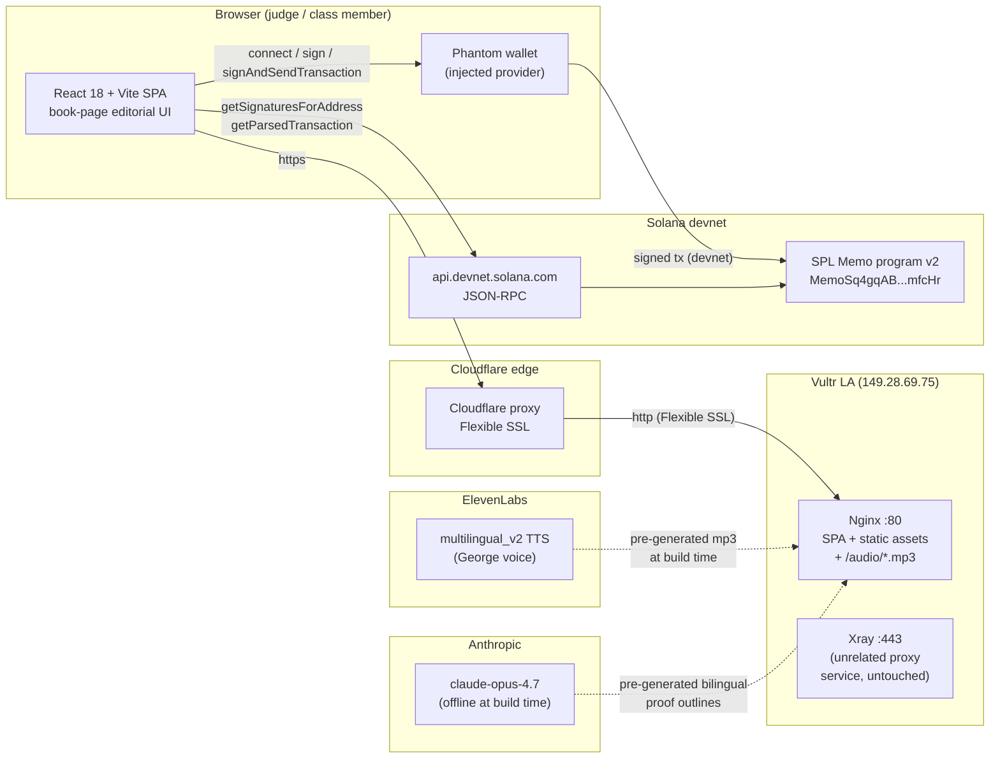

# Math Class Website

> A bilingual class collaboration website with **real Solana on-chain memory**, **off-chain ed25519 identity proof**, **ElevenLabs French narration**, and **Claude bilingual mathematical reasoning** — built solo by a first-year mathematics student at Renmin University of China · Suzhou campus, with AI-assisted development.

[](https://rucmathclass.com/)
[](https://rucmathclass.com/web3-profile)
[](https://solscan.io/tx/5L76cFugqS8qyt5XozqJr3Brt4sf7ZWhsyrqdiqmJPZ4gpDU4cnFN3Ph9TDWTYgrEEL8qsrPajpJSQwcn56gv846?cluster=devnet)

---

## TL;DR — Seven things judges can verify in under 5 minutes

| # | Capability | What to check | Where |
|---|---|---|---|
| 1 | **Real Solana wallet connection** | Connect Phantom on `/web3-profile`, see public key | https://rucmathclass.com/web3-profile |
| 2 | **Off-chain ed25519 ownership proof** | Section 02 — sign a bilingual student statement, copy base58 signature | https://rucmathclass.com/web3-profile#identity-proof |
| 3a | **Real on-chain devnet write — SPL Memo path** | Section 03 — anchor a memo via SPL Memo v2, view on Solscan | [first anchor tx](https://solscan.io/tx/5L76cFugqS8qyt5XozqJr3Brt4sf7ZWhsyrqdiqmJPZ4gpDU4cnFN3Ph9TDWTYgrEEL8qsrPajpJSQwcn56gv846?cluster=devnet) |
| 3b | **Custom Rust Anchor program (`class_anchor`) on devnet** | Section 03 — anchor via the custom program; source in `programs/class-anchor/`; deployment notes in [`docs/anchor-program.md`](docs/anchor-program.md) | [`programs/class-anchor/src/lib.rs`](programs/class-anchor/src/lib.rs) |
| 4 | **Live class collective memo feed (read)** | Section 04 — `getSignaturesForAddress` + parsed-tx decode across class wallets | https://rucmathclass.com/web3-profile#onchain-feed |
| 5 | **ElevenLabs French narration — Generate Speech path** | Home title page — `▶ Écouter` button plays a `multilingual_v2` mp3 | https://rucmathclass.com/ |
| 6 | **Claude bilingual proof reasoning** | Home daily theorem — expand `Voir la preuve · 查看证明思路`, see Chinese + French side-by-side | https://rucmathclass.com/ |

Verifiable artefacts:

- Public GitHub (MIT): https://github.com/jsfjsf20070513-a11y/MathClassWebsite-public
- First on-chain anchor (SPL Memo): [tx 5L76cFugq…56gv846](https://solscan.io/tx/5L76cFugqS8qyt5XozqJr3Brt4sf7ZWhsyrqdiqmJPZ4gpDU4cnFN3Ph9TDWTYgrEEL8qsrPajpJSQwcn56gv846?cluster=devnet) (devnet)
- Custom Anchor program: see [`docs/anchor-program.md`](docs/anchor-program.md) for program ID + deploy tx
- Architectural narration: see [§ Architecture](#architecture) below

---

## Why this project exists

Math Class Website started as a small portfolio for a bilingual mathematics class — Chinese and French students learning the same subject in two languages. The original site keeps a calm, book-page tone: course schedule, daily theorem, photo plates, reading paths, collaboration drafts. It looks more like a shared class notebook than a typical dApp.

For Dev3pack, I extended that book — without tearing pages out of it — with a parallel `/web3-profile` route that anchors student identity and contribution memory onto Solana. The bilingual nature of the class matched both Dev3pack co-host tracks I am submitting against: **Solana** (real on-chain anchor in §03 — both via SPL Memo v2 and via a custom Rust Anchor program `class_anchor` written and deployed to devnet for this hackathon) and **ElevenLabs** (real French voice narration on the home page via the Generate Speech integration path). Anthropic Claude is used as a development assistant — most visibly in the 24 bilingual theorem proofs rendered with KaTeX, surfaced under each daily theorem.

The class is the protagonist. Web3 and AI are layers on top of the class, not a replacement for it.

---

## Architecture



**Key separation that protected the user during development:** Xray on port 443 is a personal proxy out-of-scope to this project. The dApp's HTTPS terminates at the Cloudflare edge in **Flexible SSL** mode and reaches the origin Nginx on port 80 — so port 443 was never disturbed and the user's proxy service stayed live for the entire build.

A subtle but important detail: when Xray itself routes outbound `rucmathclass.com` traffic via its own out-gateway IP, the local DNS resolver returned `149.28.69.75` (the VPS itself) and the Reality protocol fell back to `www.microsoft.com`, breaking the loop. Fixed by hardcoding Cloudflare anycast IPs into the VPS `/etc/hosts` and pointing `systemd-resolved` at `1.1.1.1` / `8.8.8.8`. Documented in commit history.

---

## Six features in detail

### 1 — Wallet identity (Section 01 of `/web3-profile`)

- Detects an injected Solana provider (`window.phantom.solana` or `window.solana`)
- Falls back gracefully when no wallet is installed (link to `phantom.app/download`)
- Auto-binds to `connect`, `disconnect`, `accountChanged` events to keep UI in sync

### 2 — Off-chain ed25519 ownership proof (Section 02)

- Builds a bilingual student statement (Chinese + French + wallet + ISO timestamp)
- Calls `provider.signMessage(encoded, 'utf8')` — never sees private keys
- Encodes the signature in base58 via an inline encoder (no `bs58` runtime dep, no audit warnings)
- Independently verifiable by anyone holding the public key (`@solana/web3.js verify`, `tweetnacl`)

### 3 — Real on-chain devnet anchor (Section 03)

Two anchor paths share this section, both real and both on Solana devnet:

**Path A — SPL Memo program v2** (the lightweight, no-program-state route)

- Builds a `TransactionInstruction` against `MemoSq4gqAB...mfcHr` (SPL Memo program v2)
- ASCII-only payload: `math-class-website:1|tag=student-profile|wallet=<addr>|issued=<iso>` — readable on Solscan without specialized tooling
- Sends via `provider.signAndSendTransaction` with a 90s timeout safeguard
- Confirms at `confirmed` commitment, gracefully soft-fails confirmation timeout (signature is already on-chain)
- Auto-detects insufficient devnet SOL (< 0.005) and surfaces a deep-link to `faucet.solana.com`
- Pre-empts Phantom's "Request blocked" warning with an explicit notice + GitHub source-code link so judges can audit the exact instruction bytes before approving

**Path B — Custom `class_anchor` Anchor program** (a Rust program written + deployed for Dev3pack)

- A minimal Rust program written with the Anchor framework (0.29), source in [`programs/class-anchor/src/lib.rs`](programs/class-anchor/src/lib.rs)
- Single instruction `anchor_statement(nonce, statement)` creating a `ClassAnchor` PDA seeded by `[b"class_anchor", signer.key, nonce_le_bytes]`
- Per-anchor account stores `author: Pubkey`, `statement: String (≤200)`, `timestamp: i64`, `nonce: u64`, `bump: u8` and emits a `StatementAnchored` event
- **Deployed to Solana devnet at program ID `Cmv8pnxAaCfo8PtMZowcKTRv85Y5BvT7U2zYfspBC4fu`** ([Solscan account](https://solscan.io/account/Cmv8pnxAaCfo8PtMZowcKTRv85Y5BvT7U2zYfspBC4fu?cluster=devnet) · [deploy tx](https://solscan.io/tx/3t33ioCpWyHZ6uWGyZvaJBwejhANxs6DGFMnL2ucXSc7Tr8kxUhGe53AwL4BWMGfu3BLv4hhtch7fmVr6umgVXgo?cluster=devnet))
- **First public `anchor_statement` call from the production site** on 2026-05-09 — [tx TLYjToQB…m9vX](https://solscan.io/tx/TLYjToQBbvDioD8NqByiBxhH6UqSgftss29NJ6LAxSZKTENLYdHFtfYrq27pEXRHZnJUY7H6y7PMjub2Qtmm9vX?cluster=devnet) → [PDA 65RxSkm4…DaC2G8](https://solscan.io/account/65RxSkm4UtE8tbAknGxRe9LCfDssJtGaAvZAmXDaC2G8?cluster=devnet) (statement: `2026 春季黑客松 — 第一笔从 production 站点写的 anchor`)
- Front-end client [`src/lib/classAnchor.js`](src/lib/classAnchor.js) calls the program through `@coral-xyz/anchor` 0.29 with the IDL pinned in [`src/lib/classAnchor.idl.json`](src/lib/classAnchor.idl.json)
- Dedicated demo page at **[/witness](https://www.rucmathclass.com/witness)** ([source](src/pages/SolanaWitness.jsx)) — connect Phantom on devnet, anchor a statement, see the PDA appear in the read-back history
- Full deployment notes in [`docs/anchor-program.md`](docs/anchor-program.md)
- Open-sourced under MIT alongside this repo

### 4 — Live class collective memo feed (Section 04)

- Reads `getSignaturesForAddress` + `getParsedTransaction` directly from `api.devnet.solana.com`
- Filters instructions to the Memo program and decodes UTF-8 payloads
- Two views:
  - **My wallet** — connected wallet's last 8 memos
  - **Class collective · N** — aggregated across N registered class wallets, sorted by `blockTime`
- New wallets register automatically when they connect (persisted in `localStorage`)
- Each entry deep-links to Solscan, attributable to the originating wallet

### 5 — ElevenLabs French narration (Home page)

**Integration path used: Generate Speech** (one of the seven Eligible Integration Paths listed in the ElevenLabs Dev3pack track — the others being Transcribe Speech, Compose Music, Create Sound Effects, Dub Audio, Create Voices, and Deploy Agents).

- 14-second French intro (`Trente mathématiciens, une classe / Fenêtre sur le présent / class introduction / Pour la classe`)
- Voice: **George** (warm, captivating storyteller), model: **`eleven_multilingual_v2`**
- API key was used in-memory only during generation; never written to any file or commit
- Static [`public/audio/carnet-fr-intro.mp3`](public/audio/carnet-fr-intro.mp3) (229 KB, 128 kbps mono) served by Nginx with `Content-Type: audio/mpeg`
- Custom play/pause control preserves the editorial book-page aesthetic (red italic underlined text, small-caps `Voice by ElevenLabs · multilingual_v2` credit)
- User flow: visitor lands on the home title page → sees the bilingual motto `Trente mathématiciens, une classe / Fenêtre sur le présent` → clicks `▶ Écouter` → hears the same line spoken in French in the George voice. No login, no install, no extra clicks.

### 6 — Claude bilingual proof reasoning (Home page)

- 24 mathematical theorems each have a Chinese + French proof outline (Bolzano-Weierstrass, Cauchy criterion, Lagrange MVT, rank-nullity, spectral theorem, Bayes, LLN, Heine-Borel, FTC, Taylor, Cauchy-Schwarz, Gram-Schmidt, Cayley-Hamilton, SVD, orthogonal projection, Markov, Chebyshev, total expectation, Jensen, CLT, Banach fixed point, Fubini, inverse function, Lax-Milgram)
- Generated by Anthropic Claude (`claude-opus-4.7`) directly during a development session
- Stored statically in [`src/data/theoremExplanations.js`](src/data/theoremExplanations.js) because the public deployment runs on free static infrastructure without a server-side API key
- A production deployment would route runtime requests through a Cloudflare Worker that holds the key — documented in [`explanationsCredit.scope`](src/data/theoremExplanations.js)
- Disclosed as a `<details>` element under each daily theorem with a small-caps credit line `BILINGUAL REASONING BY ANTHROPIC CLAUDE · CLAUDE-OPUS-4.7`

---

## Tech stack

| Layer | Tooling |
|---|---|
| Frontend | React 18, React Router 7, Vite 5 |
| Solana | `@solana/web3.js` v1.95, `bs58` v6, SPL Memo program v2, Phantom-compatible injected wallet |
| AI | Anthropic Claude (`claude-opus-4.7`) for bilingual reasoning, ElevenLabs `multilingual_v2` for French TTS |
| Backend | Supabase (anon key only, RLS enforced) for optional comments / collaboration drafts |
| Hosting | Vultr LA VPS, Nginx 1.18, Cloudflare proxy (Flexible SSL), `rucmathclass.com` registered through Cloudflare-compatible registrar |
| Build | npm, ESLint flat config, Mermaid for architecture diagram |
| AI-assisted dev | Codex (GPT-5.5), Claude (Opus, Sonnet), Gemini |

Production audit: `npm audit --omit=dev --audit-level=high` reports **0 vulnerabilities**.

---

## Live URLs

| | URL |
|---|---|
| Class homepage | https://rucmathclass.com/ |
| Hackathon showcase | https://rucmathclass.com/hackathon |
| Web3 student profile | https://rucmathclass.com/web3-profile |
| Health endpoint | https://rucmathclass.com/health |
| Health JSON | https://rucmathclass.com/health.json |
| French narration mp3 | https://rucmathclass.com/audio/carnet-fr-intro.mp3 |
| First on-chain memo (Solscan) | [tx 5L76cFugq…56gv846 (devnet)](https://solscan.io/tx/5L76cFugqS8qyt5XozqJr3Brt4sf7ZWhsyrqdiqmJPZ4gpDU4cnFN3Ph9TDWTYgrEEL8qsrPajpJSQwcn56gv846?cluster=devnet) |

---

## Local development

```bash
git clone https://github.com/jsfjsf20070513-a11y/MathClassWebsite-public.git
cd MathClassWebsite-public
cp .env.example .env.local        # optional: only needed if you wire up Supabase
npm install
npm run dev                       # http://localhost:5173
```

```bash
npm run lint
npm run build
npm run preview
```

> Phantom only injects its provider on `https://`, `localhost`, and `127.0.0.1`. Use `npm run dev` (localhost) to test wallet flows locally without a real domain.

---

## Environment variables

Only `VITE_`-prefixed variables are read at build time, and they ship to the browser bundle. Never put a Supabase service-role key, an Anthropic API key, or any other server-side secret in `.env.local`.

```
VITE_SUPABASE_URL=
VITE_SUPABASE_ANON_KEY=
```

The dApp does **not** read any AI provider keys at runtime — Claude and ElevenLabs content is generated offline and stored as static assets.

---

## Deployment

Build locally, then sync `dist/` to the Nginx root:

```bash
npm run build
export MATHCLASS_DEPLOY_HOST=<server-ip-or-host>
export MATHCLASS_DEPLOY_USER=<server-user>
export MATHCLASS_DEPLOY_SSH_KEY="$HOME/.ssh/<deploy-key>"
export MATHCLASS_DEPLOY_DIR=/var/www/<project>/dist
./deploy.sh
```

`deploy.sh` reads only environment variables — no SSH key paths, hostnames, or usernames are committed.

The included [`deployment/nginx/mathclasswebsite.conf`](deployment/nginx/mathclasswebsite.conf) supports SPA fallback, gzip, immutable asset caching, and an exact-match `/health` endpoint that returns JSON instead of the SPA HTML.

For HTTPS, the canonical setup is **Cloudflare proxy + Flexible SSL** so HTTPS termination happens at the edge and the origin only needs port 80. Useful when the VPS already runs another service on 443.

---

## Security & honest scope

- **Builder role**: I am a first-year mathematics student, not a fullstack developer. Implementation is AI-assisted (Claude, Codex, Gemini); product direction, content, deployment decisions, and final validation are mine.
- **Wallet usage**: The dApp never sees private keys or seed phrases. It uses the wallet only as an identity layer and for one short, ASCII-only memo transaction on devnet.
- **No mainnet writes**: All transactions go to Solana devnet exclusively. Devnet SOL has no monetary value.
- **No API keys at runtime**: ElevenLabs and Anthropic keys were used in-memory only during static generation; neither is read by the deployed app.
- **Supabase**: Only the `anon` key reaches the browser. RLS is enforced on `comments`; no service-role key is ever used in this repo.
- **No real class photos in this public repo**: SVG placeholders only. Real class photos, admin SQL, and the production `.env` live outside this repository and are injected into the production build at deploy time via `scripts/prepare-private-assets.mjs` (gated by the `MATHCLASS_PRIVATE_REPO` env var). The repository itself never carries class photo binaries or any commit history of them.
- **The Spring 2026 schedule is intentionally public**: `src/data/siteContent.js` keeps the actual registered timetable verbatim — including teacher names, classroom codes, and time-slot annotations — because that fidelity is the credibility signal for an "honest student builder" hackathon submission. The corresponding faculty members are publicly listed on the institute's official course catalogue, so this is information disclosure, not privacy disclosure.

---

## Roadmap (post-Dev3pack)

- Streaming Claude Q&A via Cloudflare Worker (server-side API key, runtime answers)
- Wallet-linked Supabase student profile (Web2 ↔ Web3 bridge using Sign-in with Solana)
- Soulbound contribution badge for active class members (Solana cNFT via Metaplex Bubblegum)
- Cross-class identity portability via wallet signature exchange
- Real-time collective dashboard pulling from a Helius-indexed memo subscription

---

## License

**MIT License** — see [`LICENSE`](LICENSE). Class photos are **not** part of this public repository (they're injected at deploy time from a private sibling clone). The MIT grant covers the source code; specific class content (photo binaries, admin SQL, production `.env`) is reserved. The bilingual class schedule and the bilingual proof outlines, by contrast, are intentionally part of this public source — see "Security & honest scope" above.
